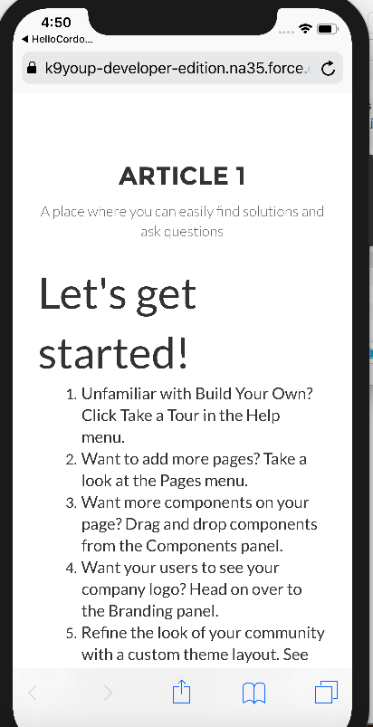

# sicom-app

## Set up
```
1. git clone https://github.com/anamitrasarkar/sicom-app.git
2. cd to the app folder
3. npm install
4. Check cordova version in terminal (cordova -version)
5. If no response, npm install -g cordova
```

## Build and Run
```
1. cordova build
2. cordova run ios
```


## Errors
```
If you run into any errors like 'Error: xcrun simctl list -json', just run XCode again it most likely need updates, once updates are installed it will work fine.


### Note
When you initialize the app in the simulator for the first time and you enter store id, the store code API takes few seconds to return response.
```

## Screen Shots




